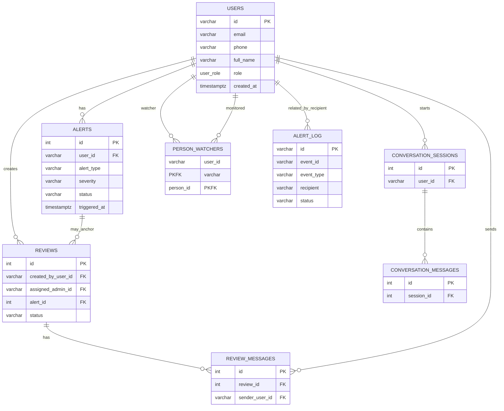

# Database schema — companion-backend (extracted)

Source: `companion-backend/app/models.py`

This document summarizes the production DB schema as defined by the application's SQLAlchemy models and related bootstrap SQL. It lists tables, columns, primary keys, foreign keys, important indexes/constraints, and relationships.

---

## Tables

### users
- Columns:
	- `id` varchar(36) — PK. Application default: uuid4 string.
	- `email` varchar(255) — UNIQUE, NOT NULL.
	- `phone` varchar(30) — nullable.
	- `hashed_password` varchar(255) — NOT NULL.
	- `full_name` varchar(255) — NOT NULL.
	- `role` user_role (enum) — NOT NULL.
	- `is_active` boolean — default TRUE.
	- `consent_given` boolean — default FALSE.
	- `consent_date` timestamptz — nullable.
	- `preferences` EncryptedJSON (JSONB) — nullable; application-level encryption.
	- `created_at` timestamptz — default now/UTC.
- Primary key: `id`
- Notes: identity table used across services; `preferences` is encrypted at application layer.

### person_watchers
- Columns:
	- `user_id` varchar(36) — FK → `users.id`, PK (composite).
	- `person_id` varchar(36) — FK → `users.id`, PK (composite).
	- `created_at` timestamptz — default now.
- Primary key: (`user_id`, `person_id`)
- Foreign keys: `user_id` → `users.id`, `person_id` → `users.id`
- Purpose: junction table mapping monitored person → watcher (self-referential on `users`).

### alert_log
- Columns:
	- `id` varchar(36) — PK. Application default: uuid4 string (bootstrap may use gen_random_uuid()).
	- `event_id` varchar(36) — nullable, correlation id to source event.
	- `event_type` varchar(50) — NOT NULL.
	- `channel` varchar(20) — NOT NULL (e.g., `email`, `sms`, `websocket`).
	- `recipient` varchar(255) — NOT NULL (email, phone, or `broadcast`).
	- `status` varchar(20) — default `sent`.
	- `created_at` timestamptz — default now.
- Primary key: `id`
- Notes: append-only audit table used by `alert_service` and backend.

### alerts
- Columns:
	- `id` integer — PK, autoincrement.
	- `user_id` varchar(36) — FK → `users.id`, NOT NULL.
	- `alert_type` varchar(30) — NOT NULL.
	- `severity` varchar(20) — NOT NULL.
	- `status` varchar(30) — default `pending`.
	- `triggered_at` timestamptz — NOT NULL.
	- `escalated_at` timestamptz — nullable.
	- `resolved_at` timestamptz — nullable.
	- `metadata` (EncryptedJSON → JSONB) — nullable. (ORM maps as `metadata_json`)
	- `notified_contacts` (EncryptedJSON → JSONB) — nullable.
- Primary key: `id`
- Foreign keys: `user_id` → `users.id`

### conversation_sessions
- Columns:
	- `id` integer — PK, autoincrement.
	- `user_id` varchar(36) — FK → `users.id`, NOT NULL.
	- `started_at` timestamptz — NOT NULL.
	- `ended_at` timestamptz — nullable.
	- `message_count` integer — default 0.
- Primary key: `id`

### conversation_messages
- Columns:
	- `id` integer — PK, autoincrement.
	- `session_id` integer — FK → `conversation_sessions.id`, NOT NULL.
	- `role` varchar(20) — NOT NULL.
	- `content` text — NOT NULL.
	- `timestamp` timestamptz — NOT NULL.
- Primary key: `id`

### system_events
- Columns:
	- `id` integer — PK, autoincrement.
	- `service_name` varchar(60) — NOT NULL.
	- `event_type` varchar(60) — NOT NULL.
	- `payload` EncryptedJSON (JSONB) — nullable.
	- `received_at` timestamptz — NOT NULL.
- Primary key: `id`

### reviews
- Columns:
	- `id` integer — PK, autoincrement.
	- `created_by_user_id` varchar(36) — FK → `users.id`, NOT NULL.
	- `assigned_admin_id` varchar(36) — FK → `users.id`, nullable.
	- `alert_id` integer — FK → `alerts.id`, nullable.
	- `review_type` varchar(40) — NOT NULL.
	- `subject` varchar(255) — NOT NULL.
	- `status` varchar(30) — default `open`.
	- `created_at` timestamptz — default now.
	- `updated_at` timestamptz — default now, on update.
- Primary key: `id`

### review_messages
- Columns:
	- `id` integer — PK, autoincrement.
	- `review_id` integer — FK → `reviews.id`, NOT NULL.
	- `sender_user_id` varchar(36) — FK → `users.id`, NOT NULL.
	- `sender_role` user_role (enum) — NOT NULL.
	- `message_type` varchar(20) — NOT NULL, default `message`.
	- `content` text — NOT NULL.
	- `timestamp` timestamptz — default now.
- Primary key: `id`

---

## Important relationships
- `users.id` → `alerts.user_id`, `conversation_sessions.user_id`, `reviews.created_by_user_id`, `reviews.assigned_admin_id`, `review_messages.sender_user_id`, and both columns in `person_watchers`.
- `alerts.id` → `reviews.alert_id` (optional link).
- `conversation_sessions.id` → `conversation_messages.session_id`.
- `reviews.id` → `review_messages.review_id`.
- `person_watchers` is a self-join on `users` (watcher → monitored person).

## Indexes & constraints (implemented elsewhere)
- `person_watchers` and `alert_log` have indexes in bootstrap SQL (check `infra/postgres/init.sql`).
- Consider adding indexes on: `alerts.user_id`, `reviews.created_by_user_id`, `review_messages.review_id`, `conversation_sessions.user_id`, `system_events.received_at` for dashboard queries.
- Many status/type columns are free-text; DB CHECK constraints or enums are recommended for `alerts.status`, `reviews.status`, `alert_log.status`, and `review_messages.message_type`.

## Security & PII notes
- PII: `users.email`, `users.phone`, `users.full_name`, `consent_date`, `preferences`, `alerts.metadata`, and `review_messages.content` may contain sensitive personal data. Access should be controlled and logs/audit reviewed.
- `EncryptedJSON` fields are encrypted at application layer; backups and replicas still contain encrypted JSON — ensure encryption keys are managed and rotated safely.

## Mermaid ER diagram

---

If you'd like this saved to `docs/` or expanded to include exact Alembic migration line references and suggested ALTER statements, I can produce that next.

